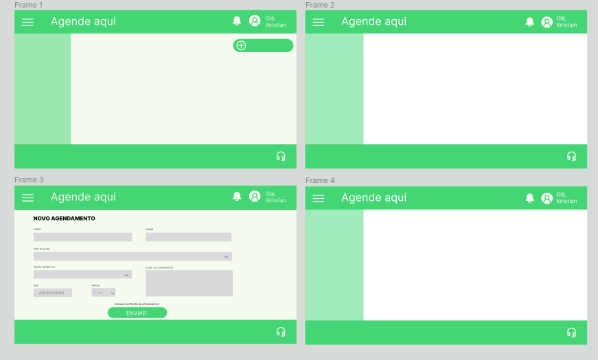

# ABP-Front-End - Agende Aqui

<!-- Título do Projeto -->
<h1 align="center">Projeto de ABP da matéria de Front End do curso de Engenharia de Software da UniSatc.</h1>

## Sobre

<!-- Descrição do Projeto -->
<p align="left">
  O projeto a seguir visa facilitar o processo de agendamento nas unidades básicas de saúde da cidade. Atualmente, o método para marcar consultas ou procedimentos ocorre com a obtenção de senhas presencialmente por ordem de chegada ou então, por agendamentos via telefone.
</p>

<p align="left">
Sendo assim, buscamos automatizar o meio existente implementando um portal onde os agendamentos ocorram de forma on-line. Nesse ínterim, entendemos também a limitação de pessoas idosas que não têm o costume de lidar ativamente com tecnologia, desse modo, identificamos que a melhor forma seria dividir a quantidade de senhas diárias, semanais ou mensais para que tenham uma cota de obtenção pela modalidade presencial (quantidade administrada pelo próprio posto de saúde), não prejudicando aqueles que já estão acostumados com essa estrutura.
</p>

<p align="left">
Na plataforma, o usuário poderá realizar seu cadastro e a partir de um menu selecionar a ação que deseja. Nas opções, serão incluídos direcionamentos para as telas de agendamento, histórico de consultas, informações e atendimento on-line. Em contrapartida, existirão telas onde a permissão ficará reduzida aos funcionários das unidades para realizar a administração dos dados.
</p>

## Operações disponíveis

<ul>
<li>Administração</li>
<li>Cadastro e edição de usuários</li>
<li>Agendamento das consultas</li>
<li>Consulta de horários para o agendamento</li>
<li>Confirmação de horários para o agendamento</li>
<li>Inclusão de histórico por paciente</li>
<li>Atendimento on-line com profissional</li>
</ul>

## Linguagens e Ferramentas Utilizadas

Aqui estão as linguagens de programação e ferramentas utilizadas no projeto:

<ul>
<li>HTML</li>
<li>CSS</li>
<li>JavaScript</li>
<li>React.js</li>
<li>Git</li>
</ul>

## Desenvolvedores

Abaixo, a equipe envolvida neste projeto.

<ul>
<li><a href="https://github.com/anacarolina1002">Ana Carolina Machado</a></li>
<li><a href="https://github.com/ArturBarbos4">Artur Borges</a></li>
<li><a href="https://github.com/Xiristian">Christian Giuliani</a></li>
<li><a href="https://github.com/judwluca">Julia De Luca</a></li>
<li><a href="https://github.com/luzbrendaoliv">Luz Brenda  Oliveira</a></li>
</ul>


## Figma

<p>
Para os demais fins, disponibilizamos o layout criado no figma que irá guiar a produção das telas durante o projeto.
</p>

<p style="margin-bottom: 10px;">
<a href="https://www.figma.com/file/rN0dwuGNB8HnyAT6trEHup/Untitled?type=design&node-id=0%3A1&t=yoQMCmrCJhBRTQLY-1">
Link do Figma
</a>
</p>



<!-- Instalação -->
## Instalação

1. Clique no botão <p style= "margin-top:20px"> </p>
 e copie o Link disponível.

2. Utilizando o Link copiado, acesse o Visual Studio e no terminal clone o repositório:

   ```sh
   git clone https://github.com/seu-usuario/seu-repositorio.git
